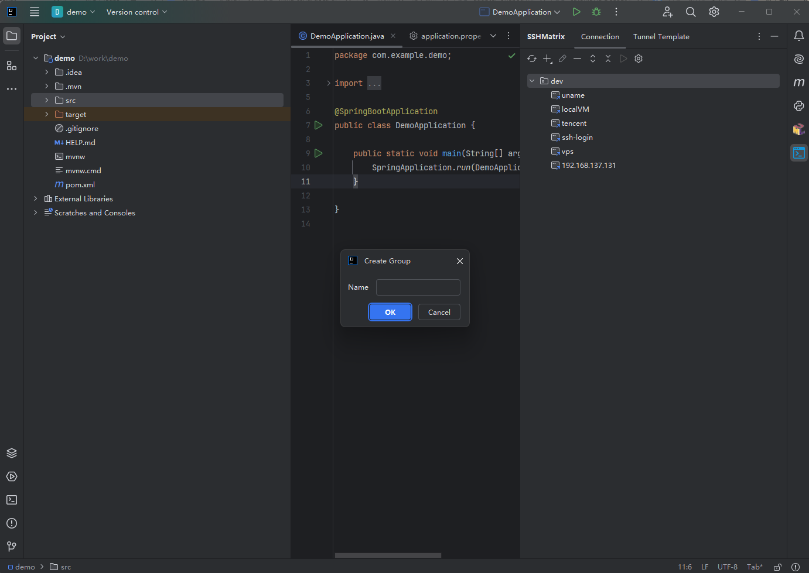
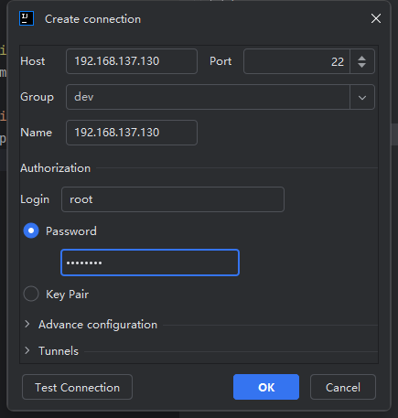
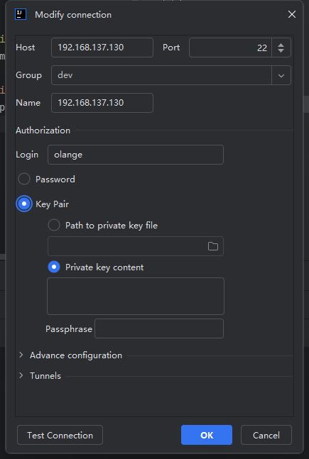
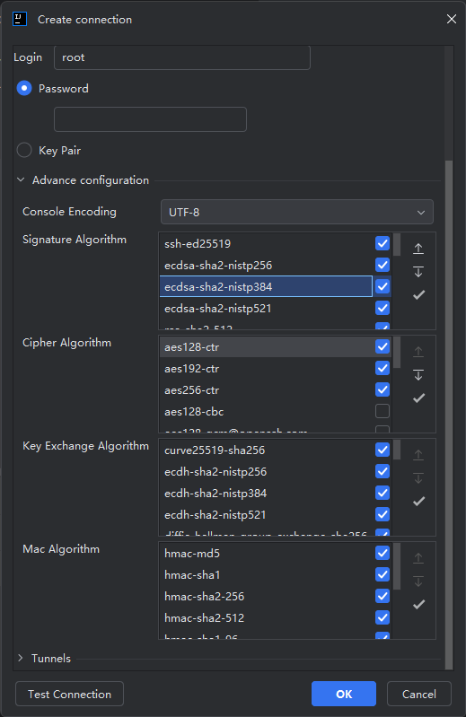

# Connection Management

## Group

Grouping different connections for easy differentiation and management

## Create New Connection

In accordance with the information provided in the form, SSH connection parameters are to be input. The given example utilizes password authentication. By selecting `Test Connection`  the connectivity will undergo validation to ascertain its operability.

> The password field is optional; in the event it remains empty, an input box will prompt for password entry upon establishing the connection.

## Key Pair

The Key Pair authentication method involves a pair of keys and offers two approaches for importing the keys: one involves selecting a key file, while the other entails directly inputting the key content.

Similarly, the key pair authentication method also supports private key password.

## Advance configuration

Different cipher algorithms can be configured, with the default settings typically meeting most requirements. However, for certain specific servers with outdated protocol versions, it may be necessary to enable deprecated and less recommended algorithms.

