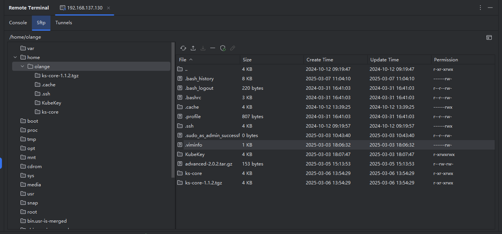
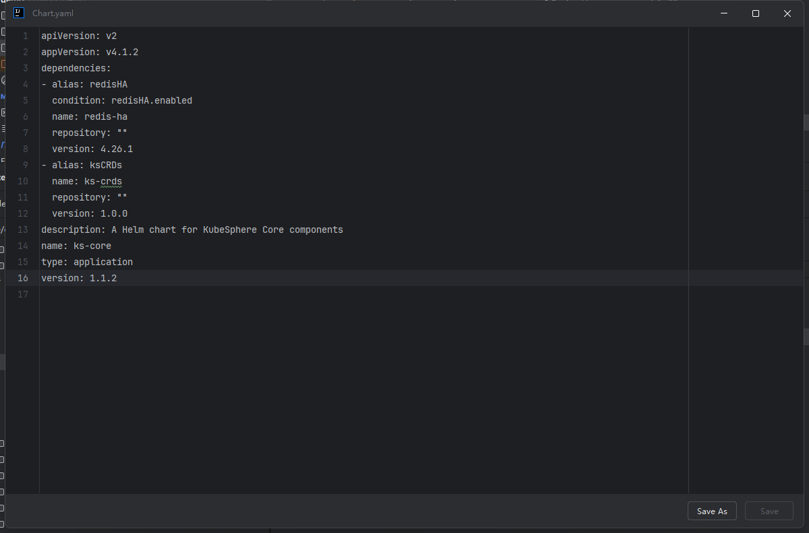

# SFTP

By clicking on the "Sftp" tab, you can switch to the SFTP page where you can view the directory structure on the server. On the left, there is a tree-like directory structure, while on the right, there is a list of files and directory information within the current directory. The input box in the middle will display the current directory, allowing you to switch directories by modifying the input box's value or double-clicking on the corresponding directory name.

##  File Management

Select a file or `double-click` on it or click the "Edit" button to open the file editing window, where you can modify the current file.

After making alterations, click the `Save` button to store the edited content on the remote server.

By clicking on `Save As` you can save the file to a local directory.

## Upload File

By selecting the `Upload` button, you have the option to choose a local file or directory to upload to the current directory on the server. When choosing to upload a directory, the directory structure of the current directory will be preserved.

## Download File

Upon selecting the desired file, simply click the `Download` button. In the ensuing pop-up window, designate the directory where you wish to store the file, initiating the download process.

## Delete File or Directory

Upon selecting a directory or file, click the `Delete` button. Following confirmation, the current directory or file will be promptly removed.

> Directory deletion is executed through recursive processes. In cases where there are numerous files or a complex hierarchical structure, efficiency may be compromised. It is recommended to utilize command prompts for expeditious directory deletion.
