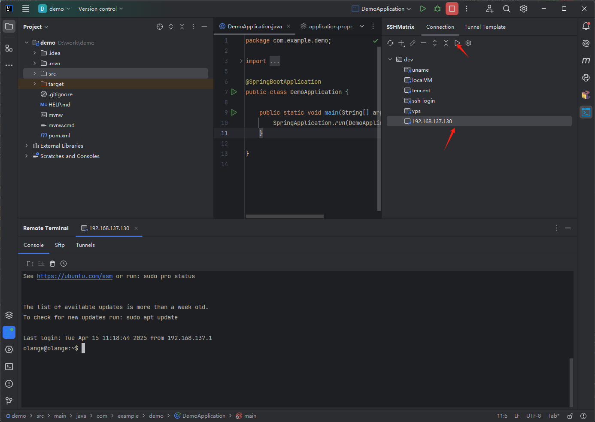
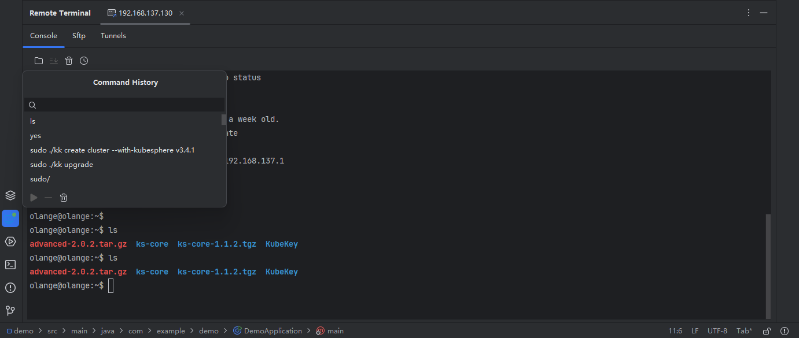

# Shell

## Open a shell 

Upon selecting a hyperlink, click the `Open` button or double-click the selected hyperlink to initiate a session window. Within the `Console` window, you have the liberty to execute any desired commands.

For user-input commands, we also offer a local command history feature. By clicking the `Command History` button, you can access, search, and execute commands within a pop-up window.

