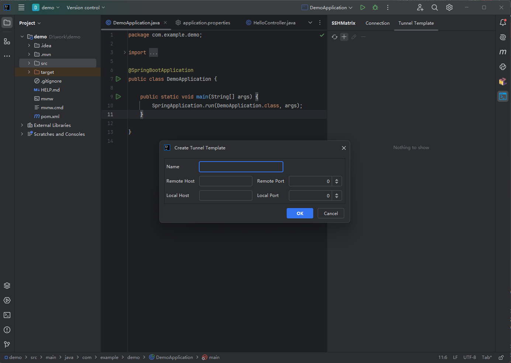
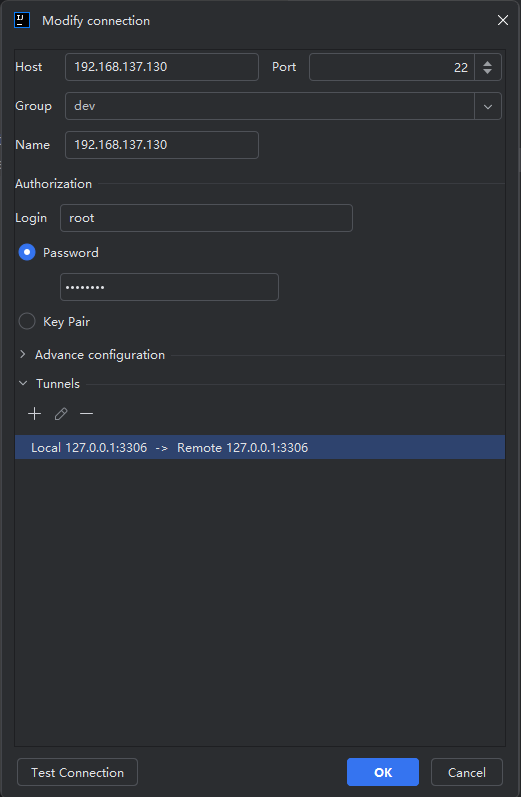
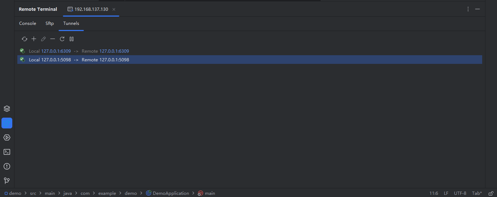

# Tunnel

## Tunnel Template

For frequently used tunnels that require activation on various servers, it is advisable to incorporate them into a tunnel template. When establishing a connection, select the relevant template to integrate the specified tunnels. By doing so, upon initiating a connection session, the corresponding tunnels will be automatically generated.

## Add Tunnel To Connection

When adding or modifying connections, it is possible to include tunnels within the connection itself. This way, upon initiating a connection session, the corresponding tunnels will be automatically established.

## Tunnel

By clicking on the `Tunnel` tab, you can navigate to the tunnel management page where existing tunnel details are displayed, including the current status of each tunnel. In the event of a tunnel activation failure, adjustments can be made based on the provided error information. This page also allows for the management, modification, deletion, addition, closure, restart, and other actions related to tunnels within the current session.

