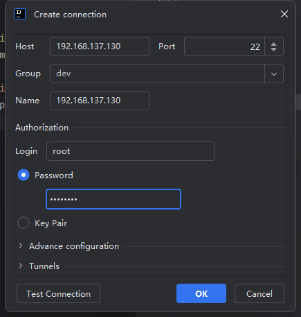
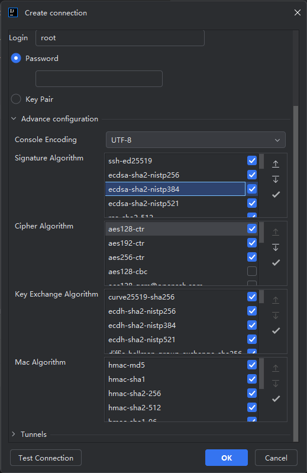

# 连接管理

## 分组
`分组` 可以用来区分和管理不同类型的连接

##  创建新的连接
根据表单输入ssh连接相关参数，这里的示例使用了密码验证方式，点击 `Test Connection` 会对连接进行验证，是否可以正常连接

> 密码可以为空，如果为空则在开启会话时会弹出输入框要求输入密码

## 密钥对

除了支持常规的 `用户/密码` 验证方式外，还支持密钥对验证方式。目前提供2种方式导入密钥
一种是选择密钥文件，还有一种是直接输入密钥内容

同样的，密钥的方式也支持私钥密码管理

## 高级配置

可以配置不同的交换算法，默认的配置已经满足大部分需求，但是对于一些特殊的服务器，比如版本协议比较旧，需要启用一些已经过期的不推荐的算法协议

