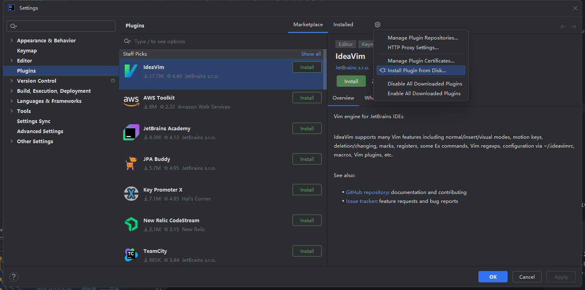

# 开始体验

## 从 `Marketplace` 中安装
通过 `Settings->Plugins` 打开插件管理页面，在插件市场中搜索 `SSHMatrix` ，然后点击 `install` 安装，安装成功后重启IDE即可

## 从本地磁盘安装
在浏览器中打开插件官网 [Marketplace](https://plugins.jetbrains.com/plugin/24625-sshmatrix/versions),
选择最新的版本进行下载

下载完成后打开 `Settings->Plugins`，点击 `Install plugin from Disk` 进行安装,安装成功后重启IDE即可

## 如何使用
在 `IDE ` 右侧可以看到多出一个 `SSHMatrix` tab栏,点击后即展开连接管理页面，更多功能使用请参考 [连接管理](connection.md)

