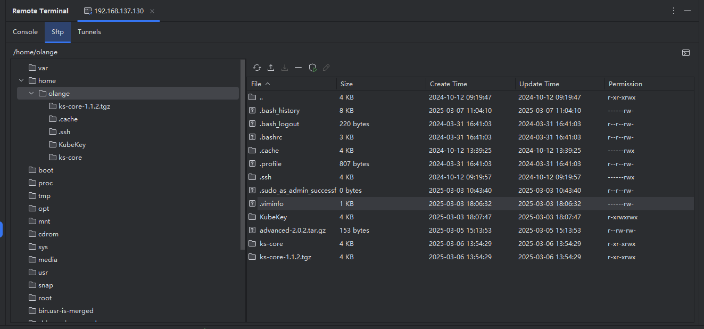

# SFTP

点击 ``Sftp`` 标签切换到 Sftp页面，可以看到服务器上的目录结构，
左边是目录树型结构，右边是当前目录下面文件和目录信息列表，中间的输入框会展示当前的目录，可以通过修改输入框的值或者双击对应的目录名称切换目录

##  文件编辑

选中文件双击或者点击编辑按钮即可打开文件编辑窗口，可以在窗口中编辑当前的文件

修改完成后点击 `Save` 按钮即可将修改后的结果保存到远程服务器

点击 ``Save As`` 则可以将文件另存到本地目录中

## 文件上传

点击 ``上传`` 按钮，可以选择本地的文件或者目录，将文件或者目录下面的文件上传到服务器的当前目录下
选择目录上传时会保留当前目录的目录结构

## 文件下载
选中想要下载的文件，点击 ``下载`` 按钮，在弹窗中选择要保存的目录后即可开始下载

## 文件删除

选中目录或者文件，点击 `删除` 按钮，确认后即可删除当前目录或者文件

注意： 目录删除是循环递归实现的，如果存在文件或者层级结构太多，效率会很多，推荐使用命令进行目录删除
