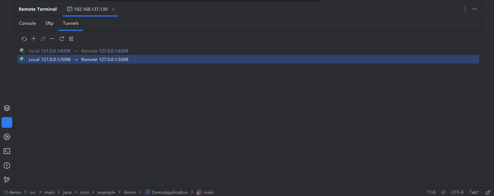

# 安全隧道

## 隧道模板

对于一些比较常用的隧道，需要在不同的服务器上分别进行开启，可以添加到隧道模板中，在创建连接时，选择对应的模板添加到隧道中，这样在开启连接会话时，就会自动创建对应的隧道了。

## 添加隧道到会话中

在新增或者修改连接时，可以添加隧道到连接中，这样在开启连接会话时，就会自动创建对应的隧道了

## 开启隧道

点击 ``Tunnel`` 标签切换到隧道管理页面，这里可以看到已经添加的隧道信息，已经当前隧道的状态，如果隧道启动失败，需要根据错误信息进行调整，在这个页面同样可以对当前会话中的隧道进行管理，修改，删除，新增，关闭，重启等等

